# Hotel Guest Feedback Form

A generic hotel guest feedback terminal to provide useful information to the hotel based on guests average score feedback for each department. Namely, the Front Desk, the Restaurant, the Spa and the Hotel Room and also asks if they wish to receive special offers.

This is useful information to the Hotel Marketing Department so that they can know;

- If the guests enjoyed their stay at the hotel.

- Encourage guests to book directly with the hotel with email offers.

- Know your customer if they wish to be contacted in the future.

This is also very helpful to provide feedback to the operations department for improvement.

The Guest Feedback Form provides a way of monitoring on a daily basis how the hotel is viewed by the guests and averages the scores made by the guests for each department.
If the scores are particularly low then improvements to that department can be implemented.
Also, if the hotel department has a high score the staff in those departments can be recognised for their hard work.

The Guest Feedback Form is currently paper based for the guests to complete upon check out. The form is short so that guests are not put off from completing the form. A hotel admin is then able to add the guest data to the terminal or with an access code view the guest data.

## Portfolio Project 3

- [Github Link](https://github.com/estii20/guest_feedback)

- [Heroku Link](https://heroku.com)

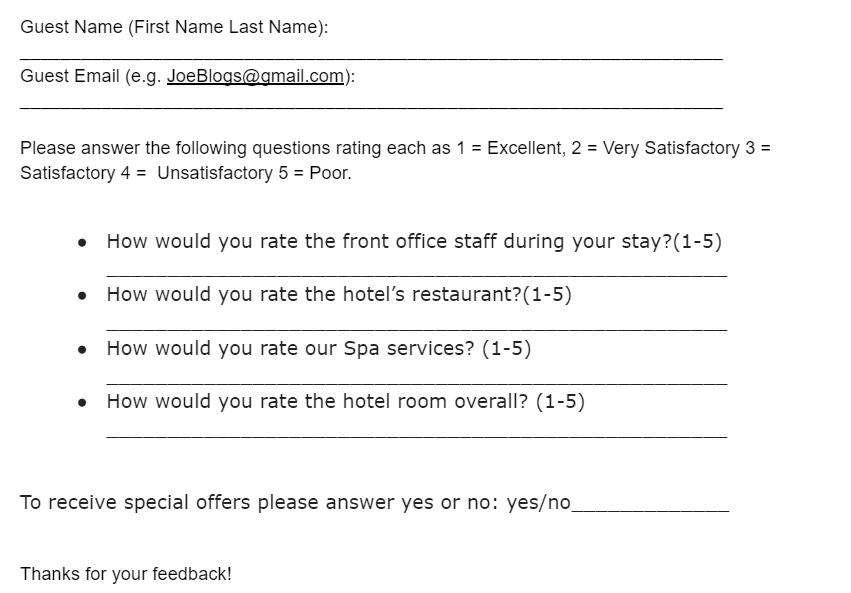

## Table of contents

How it works
1. User Experience (UX)
2. Features
3. Future Features
4. Bugs
5. Testing
6. Deployment
7. Credits
8. Acknowledgements

### User Experience (UX)

The marketing department has designed a guest feedback form on paper to encourage guests to leave their scores for the hotel based on the range 1=Excellent, 2=Very Satisfactory 3=Satisfactory 4=Unsatisfactory 5=Poor. 

It is a simple form that collects data such as Guest Name, Guest Email, Guest Score for the Front Desk, Guest Score for the Restaurant, Guest Score for the spa and Guest Score for the Hotel Room. 

Guests are also asked if they would like to receive special offers by email.

The Hotel Admin inputs this data into the Guest Feedback Terminal. This data is shared through the google sheets API to the Guest Feedback Worksheet. 

The main menu asks option to 
1. Enter Responses 
2. View Responses 
3. Exit

The main aims for the user are;

1. Easily navigate between the different functions available in the application
2. Provide clear instructions to the admin on how to add data.
3. Review and analyse data with clear terminal instructions on how to access the data.
4. Clearly understand how to interact with the application to get feedback based on the data.

## Features

__Main Menu - 1. Enter Responses or 2. View Responses 3. Exit__

The Enter Responses function gets and validates data from admin

_name_

_email_

_score for each_ (front desk, restaurant, room, spa) with a rating for each on scale 1-5. 

1. Excellent
2. Very Satisfactory 
3. Satisfactory 
4. Unsatisfactory 
5. Poor

_Special offers yes or no_

- The View Responses function
asks for a password to verify admin access. This is a hardcoded password.

- The admin provided they have given the correct password can then view the data average score for each e.g. front desk, restaurant, spa, hotel room.

- Also the admin can access the guest data. This information can then be used by the marketing department to send out special offers emails if guests have agreed to be contacted with special offers.

__Guest Name__

Asks for guest name input from the admin until name data entered correctly. The admin has to input a value greater than two. As many cultures have differing name formats, validation for first and last name to be input in letters only not required.

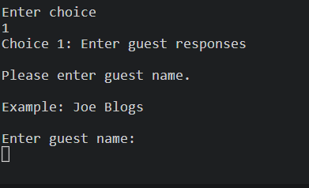

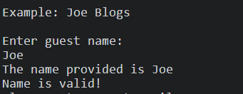

Once the Guest Name is entered correctly the worksheet under the name column is updated. 

__Guest Email__

Asks for guest email  input from the admin until email data entered correctly.

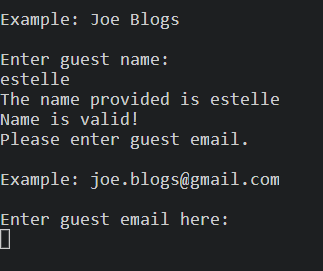

Once the Guest Email is entered correctly the worksheet under the email column is updated. 

__Guest Score__

Asks for guest score input from the admin until score data entered correctly. The score for Front Desk, Restaurant, Spa and Hotel Room are requested through prompts.

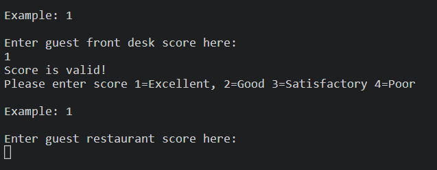

Once the Guest Score is entered correctly the worksheet under each department (Front Desk, Restaurant, Spa, Hotel Room) column is updated. 

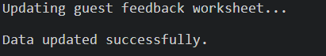

__Special Offers__

Asks for guest input from the admin if they would like to receive special offers until data entered correctly. The option for input is yes or no.

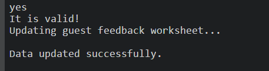

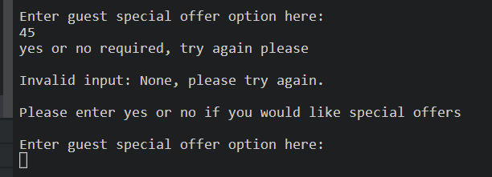

Once the data is entered correctly the worksheet under the special offers column is updated.

__Continue Adding Data or Exit__

The admin is asked if they would like to continue adding another guests feedback. `y` to continue and any key to exit the terminal.

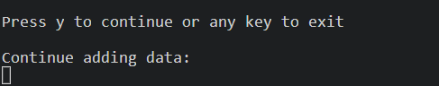

To exit the terminal

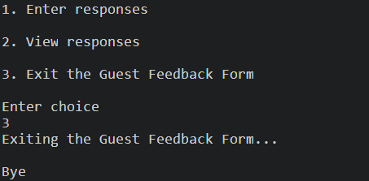

__Access Code__

For admins to view guest data they must insert a hardcoded access code.

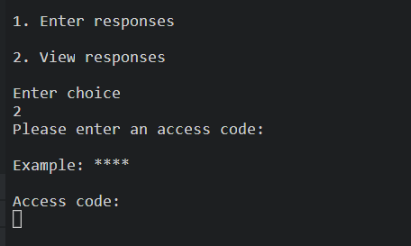

__Average Score__

The admin can access the data to provide useful average scores for each department in the hotel.

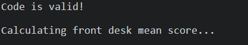

__Guest Information__

The admin can access the data to see guests feedback in the terminal. This can be used to see who wish to receive a special offer by email and also their scores.

## Future Features

It would be helpful in the future to increase the number of questions requested by the guests to provide more detail from the data.
Also using the filter function to provide more targeted guest information in the terminal.
An online platform so that guests can input their own data.
An automated email created in python sent to those guests wishing to receive the special offers.
Improved data security by maintaining a list of access codes for admins.

## Technology Used

[Python](https://www.python.org/) The language used to add interactivity to the Guest Feedback Terminal.

[Heroku](https://heroku.com/)
Provides the mock terminal for the project.

[Google Spreadsheets:](https://en.wikipedia.org/wiki/Google_Sheets) used as the external data store for the project.

[Google Drive API:](https://developers.google.com/drive/api/v3/about-sdk) used to generate credentials used in the project to securely access the Google Spreadsheet.

[Google Sheets API:](https://developers.google.com/sheets/api) used to support interactions (e.g. read/write functionality) between the code and data stored in the Google Spreadsheet.

[gspread:](https://docs.gspread.org/en/latest/) Python API for Google Sheets

[Google Auth:](https://google-auth.readthedocs.io/en/master/) Google authentication library for Python required to use the credentials generated for Google Drive API.

[GitHub:](https://github.com/) is used as the respository for the projects code after being pushed from Git.

[Heroku:](https://heroku.com) is used to deploy the application and provides an enviroment in which the code can execute

[Pandas](https://pandas.pydata.org/) is used to manipulate the data

[sys](https://docs.python.org/3/library/sys.html) to create an exit from the terminal

[re](https://docs.python.org/3/library/re.html) provides regular expression matching operations

| Test | Description | Expected Outcome | Outcome |
| --- | --- | --- | --- |
| The main menu displays the options 1 Add Responses 2. View Responses 3. Exit  | 1. Takes the admin to add data 2. Takes the admin to view the data 3. Exit the terminal | 1. Lets the admin add data 2. Lets the admin view data 3. Exits| The options 1, 2 and 3 correctly selected |
| Validates the data entry | Each time data is added to the terminal it should be validated as correct before updating the spreadsheet | The spreadsheet should only be updated once the data is entered in the correct format | Data is verified and then the spreadsheet is updated | The data is entered correctly and then the spreadsheet is updated | The score data returned to the admin is the average of the last ten scores for the hotel |
| The data is only accessed with an access code | The data can only be viewed with authorisation | The data is viewed after access is granted | Data is seen only if the correct code is given | The score shows the mean average score of each department correctly | The score mean is correctly shown in the terminal |
| Viewing guest data| Retrieves the mean score for front desk, restaurant, spa and hotel room. Plus all the guest feedback information | When selecting 2. View information the data is displayed in the terminal | Selecting 2 retrieves the data correctly |
| Add more guests or exit| Asks the admin if they would like to exit the terminal (any key but y) or add more guests *key in (y) | When selecting y. the admin can add another guest to the data, when selecting any other key the admin can exit the terminal | Selecting y asks for the guests data and any other key exits the terminal |

## Bugs and Fixes

The validation for the name entry was not allowing spaces to be entered, so I removed the `isalpha()` so that all characters can be entered. For cultural reasons this was a better solution anyway as many people have varying name formats.

The validation for special offers yes or no, I added the `lower()` so that upper and lower case versions were accepted.

## Unfixed Bugs

The DataFrame to get the mean score from the spreadsheet works, however I tried to find a way to round the result to one decimal place. Each method returned the number incorrectly. Greater understanding of pandas DataFrames will fix this problem.

The option to view the guests information in the terminal was to get those guests that selected yes to special offers. Again the filter function to the DataFrame did not get the correct guests. All guests were still displayed.

__Validator Testing__

[PEP8online.com](https://pep8ci.herokuapp.com/)

I ran code through the PEP8 validator and it displayed there was trailing white space and one line was too long. Removed the trailing white space and shortened the line in question and reran the test. The next test gave the results all clear no errors found.

## Deployment 

To access this project in GitHub;

1.  Firstly Log into [Github](https://github.com/).

2.  Select repository [estii20/guest_feedback](https://github.com/estii20/guest_feedback).

3.  Select settings from menu.

4.  Select Pages from left menu bar.

5.  Scroll and select Master branch from the drop down menu to deploy the website.

6.  Retrieve the automatically generated link from the GitHub pages section.

__Running the project locally;__

1.  To create a clone of this project follow the instructions below;

2.  Create a GitPod account [Gitpod](https://gitpod.io/login/).

3.  Open the Chrome browser.

4.  Click to the top of the Chrome navigation bar and enable the extension Gitpod Browser Extension for Chrome. 

5.  Link it.

6.  Restart the browser when prompted to do so.

7.  Log into GitPod with your account username and password.

8.  Select the project in GitHub repositories.

9.  Click on the green “Gitpod” button to the top right of the page.

10. A new gitpod workspace opens.

11. It is now possible to work locally on the project.

To make updates, it is necessary to commit with commit-m and push with git push so that the updates are pushed to Github. 

Cloning the project will link the changes to the project repo and will be sent for approval.

Forking the project will create a new repo and the code will belong to the user. Any changes made will notify the user and will give them the option to pull this new code to their repo. 

Changes pushed to the main branch will automatically update on the site.

### How to create and configure the Google spreadsheet and APIs

- Create the Google Spreadsheet 
- Log in to your Google account (create one if necessary)
- Create a Google Spreadsheet called 'guest_feedback' on Google Drive with sheets called 'feedback'.
- In row 1 of the sheet, enter the headings : name, email, front_desk, restaurant, spa, hotel_room, offers.

- Set up APIs using the Google Cloud Platform

     - Access the [Google Cloud Platform](https://console.cloud.google.com/)
     - Create a new project and give it a unique name, then select the project to go to the project dashboard
     - Setup Google Drive credentials 
   - Enable Google Sheets API 
   - Install gspread and google-auth libraries in the development environment using the command 'pip3 install gspread google-auth'

Then it is necessary to; 

Create an account with heroku.com
- Create a new Heroku App
- Set the buildbacks to Python and Node JS in that order
- Link the Heroku App to the repository
- Click on Deploy

## Credits

__Content__

Feedback Form content information researched at;

[Datalabs develop a survey or feedback form](https://thedatalabs.org/develop-survey-or-feedback-form-in-excel-and-vba/)

[Guest Joy hotel marketing all you need to know](https://guestjoy.com/blog/hotel-marketing-everything-you-need-to-know/)

__Resources__

[Range of numbers in Python](https://www.tutorialkart.com/python/python-range/python-if-in-range/#gsc.tab=0)

[Check if match email is format](https://www.geeksforgeeks.org/check-if-email-address-valid-or-not-in-python/ ) 

[How to write yes or no questions in Python](https://www.grepper.com/answers/207051/how+to+ask+a+yes+or+no+question+on+python)

[GSPREAD and Pandas tutorial](https://pypi.org/project/gspread-pandas/)

[Averages in Python](https://betterprogramming.pub/using-python-pandas-with-excel-d5082102ca27)

[Exit function](https://www.freecodecamp.org/news/python-exit-how-to-use-an-exit-function-in-python-to-stop-a-program/#:~:text=Use%20sys.,indicating%20the%20reason%20for%20termination.)

[Code Institute, Love Sandwiches Project 3 setup and deployment](https://github.com/Code-Institute-Solutions/love-sandwiches-p5-sourcecode/tree/master/02-accessing-user-data)

## Acknowledgements

Mentor - Brian Macharia

Code Institute for the deployment terminal

