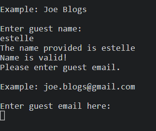
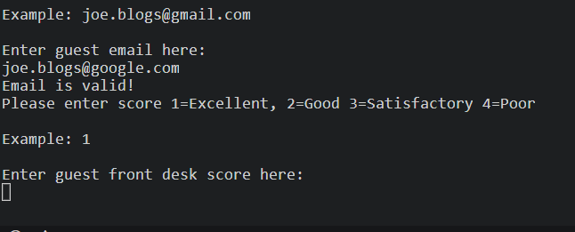

# Hotel Guest Feedback Form

A generic hotel guest feedback terminal to provide useful information to the hotel based on guests average score feedback for each department. Namely, the Front Desk, the Restaurant, the Spa and the Hotel Room.

This is useful information to the Hotel Marketing Department so that they can know if the guests enjoyed the hotel and want to rebook, email a promotional discount to book a room directly.
Encourage guests to book directly with the hotel with email offers.
Know your customer and how they wish to be contacted in the future.

This is also very helpful to provide feedback to the operations department for improvement.
The Guest Feedback Form provides a way of monitoring on a daily basis how the hotel is viewed by the guests and averages the scores made by the guests for each department.
If the scores are particularly low then improvements to that department can be implemented.
Also if the hotel department has a high score the staff in those departments can be recognised for their hard work.

The Guest Feedback Form is currently paper based for the guests to complete upon check out. The form is short so that guests are not put off from completing the form. A hotel admin is then able to add the guest data to the terminal or with an access code view the guest data.

## Portfolio Project 3

- [Github Link](https://github.com/estii20/guest_feedback)

- [Heroku Link](https://heroku.com)

## Table of contents

How it works
1. Features
2. Future Features
3. Data Model
4. Bugs
5. Testing
6. Deployment
7. Credits
8. Acknowledgements

### How it works

The marketing department has designed a guest feedback form on paper to encourage guests to leave their scores for the hotel based on the range 1 = Excellent, 2 = Good 3 = Satisfactory 5 = Poor. 

It is a simple form that collects data such as Guest Name, Guest Email, Guest Score for the Front Desk, Guest Score for the Restaurant, Guest Score for the spa and Guest Score for the Hotel Room. 

Guests are also asked if they would like to receive special offers by email.

The Hotel Admin inputs this data into the Guest Feedback Terminal. This data is shared through the google sheets API to the Guest Feedback Worksheet. 

From this worksheet there is the option to 1. Enter Responses or 2. View Responses

## Features

__Main Menu - 1. Enter Responses or 2. View Responses__

The Enter Responses function gets and validates data from admin

_name_

_email_

_score for each_ (front desk, restaurant, room, spa) with a rating for each on scale 1-5. 1 = Excellent, 2 = Good 3 = Satisfactory 5 = Poor

_Special offers yes or no_

The View Responses function
Asks for a password to verify admin access. This is a hardcoded password.

The admin provided they have given the correct password can then view the data average score for each e.g. front desk, restaurant, spa, hotel room.

Also the admin can access the email addresses of the guests wishing to receive any special offers. This information can then be used by the marketing department to send out special offers emails.

__Guest Name__

Asks for guest name input from the admin until name data entered correctly. The admin has to input a value greater than two. As many cultures have differing name formats, validation for first and last name not required.

Once the Guest Name is entered correctly the worksheet under the Name column is updated. 

__Guest Email__

Asks for guest email  input from the admin until email data entered correctly.

Once the Guest Email is entered correctly the worksheet under the Email column is updated. 

__Guest Score__

Asks for guest score input from the admin until score data entered correctly. The score for Front Desk, Restaurant, Spa and Hotel Room are requested through prompts.

Once the Guest Score is entered correctly the worksheet under each department (Front Desk, Restaurant, Spa, Hotel Room) column is updated. 

__Special Offers__

Asks for guest input from the admin if they would like to receive special offers until data entered correctly. The option for input is yes or no.

Once the data is entered correctly the worksheet under the special offers column is updated. 

__Average Score__

The admin can access the data to provide useful average scores for each department in the hotel.

__Email Special Offer__

The admin can access the data to get the email addresses of the guests who wish to receive a special offer by email.

## Future Features

It would be helpful in the future to increase the number of questions requested by the guests to provide more detail from the data.
An online platform so that guests can input their own data.
An automated email created in python sent to those guests wishing to receive the special offers.
Improved data security by maintaining a list of access codes for admins.

## Technology Used

__Python__

The language used to add interactivity to the Guest Feedback Terminal.

__Heroku__

[Heroku](https://heroku.com/)
Provides the mock terminal for the project.

